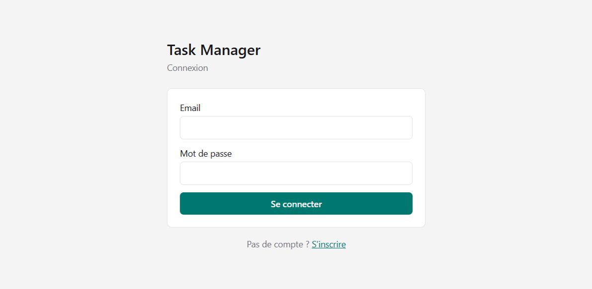
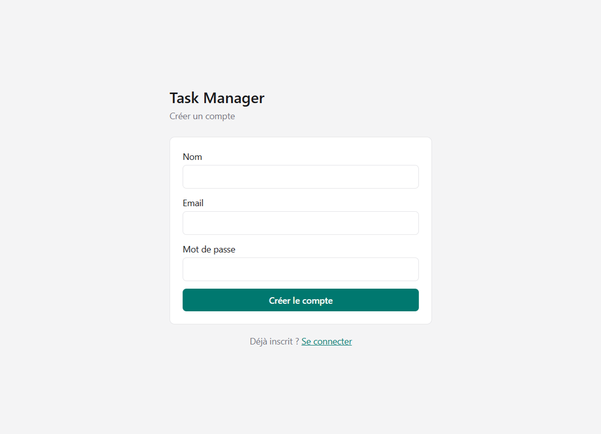
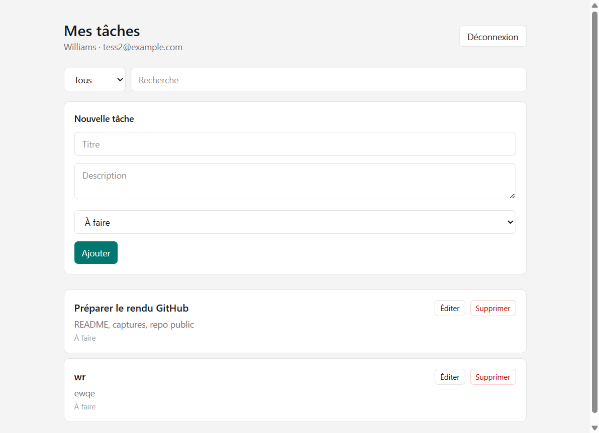

# Task Manager

Mini application de gestion de tâches (test recrutement) : API Spring Boot + front React.

## Structure

```
backend/     # Spring Boot 4 · JPA · MySQL · JWT
frontend/    # React · Vite · TypeScript · Tailwind
docker-compose.yml
```

## Prérequis

- Docker

## Démarrage

```bash
docker compose up --build
```

- UI : `http://localhost`
- API : `http://localhost/api` (nginx → backend) ou `http://localhost:8080`

Arrêt : `docker compose down`

## Fonctionnalités

- Inscription / connexion (JWT en `localStorage`)
- CRUD tâches (owner = utilisateur connecté)
- Filtre par statut + recherche texte
- Gestion d’erreurs API affichée dans l’UI


## API


| Méthode | Route                   | Auth                                     |
| ------- | ----------------------- | ---------------------------------------- |
| POST    | `/api/auth/register`    | non — body : `{ name, email, password }` |
| POST    | `/api/auth/login`       | non — body : `{ email, password }`       |
| GET     | `/api/tasks?status=&q=` | JWT                                      |
| POST    | `/api/tasks`            | JWT                                      |
| PUT     | `/api/tasks/{id}`       | JWT                                      |
| DELETE  | `/api/tasks/{id}`       | JWT                                      |


Statuts : `TODO` · `IN_PROGRESS` · `DONE`

## Architecture (choix techniques)

- **Backend :** Spring Security stateless + JJWT ; ownership strict des tâches ; filtre/recherche côté API.
- **Frontend :** pages Auth + Tasks ; client `fetch` ; session JSON dans `localStorage`.
- **DB :** MySQL interne au compose, schéma auto (`ddl-auto=update`).
- **CI :** GitHub Actions (tests backend, build front, build images Docker).
- **Hors scope actuel :** Flutter, déploiement GCP.


## Captures d’écran

Connexion :



Inscription :



Liste et CRUD des tâches :



