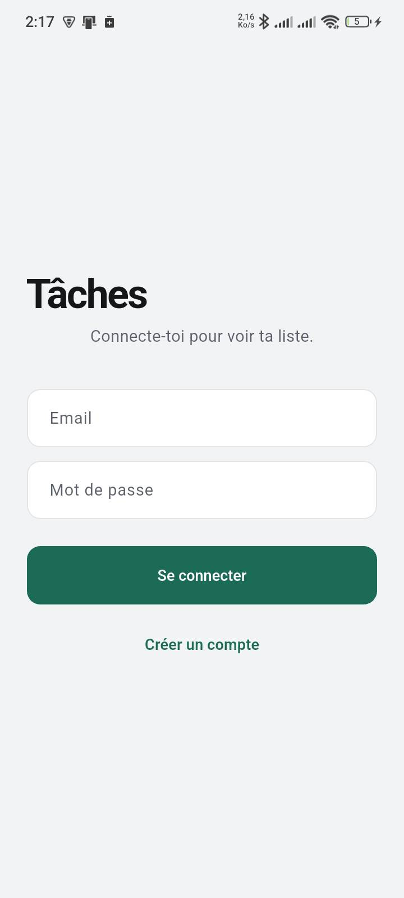
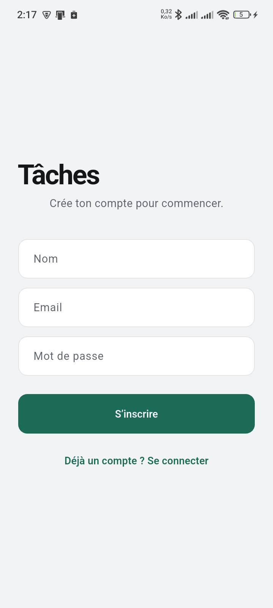
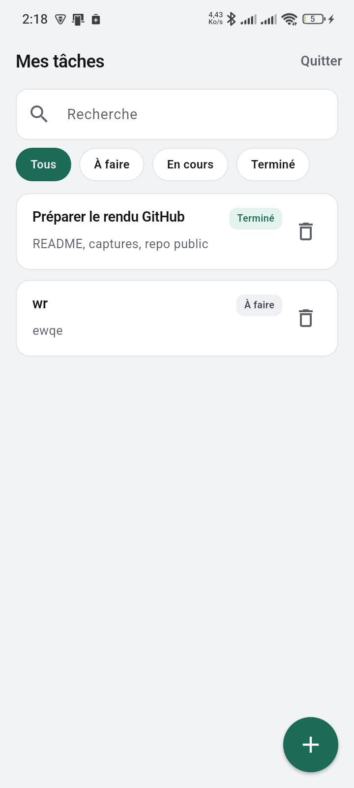
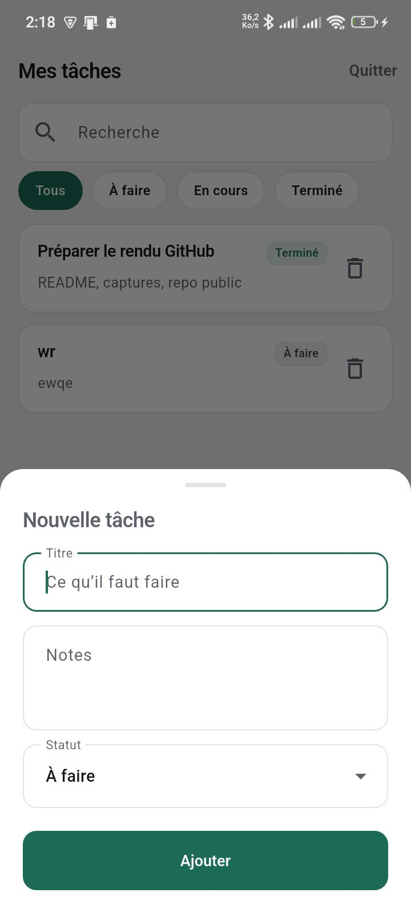

# Task Manager

Gestion de tâches avec un compte. Tu crées / modifies / supprimes tes tâches, tu filtres par statut et tu cherches dans le titre.

Stack : Spring Boot 4, MySQL, JWT, React (Vite + Tailwind), Flutter.

## Lancer

Il faut Docker.

```bash
docker compose up --build
```

Ensuite : [http://localhost](http://localhost). L’API passe par nginx (`/api`) ; le backend écoute aussi sur le port 8080.

### Android (Flutter)

API déjà lancée (compose ou backend seul sur `:8080`). Prérequis : Flutter + Android SDK.

```bash
cd mobile
flutter pub get
flutter devices
```

Émulateur Android (pointe vers le localhost de la machine) :

```bash
flutter run
```

Téléphone physique (même Wi‑Fi que le PC) — remplace par l’IP locale de ta machine :

```bash
flutter run --dart-define=API_URL=http://192.168.x.x:8080
```

Pour tout stopper : `docker compose down`.

```
backend/     API Java
frontend/    UI React
mobile/      Flutter (Android)
docker-compose.yml
```

## Configuration

### Mobile — URL de l’API

| Quoi | Où |
|------|-----|
| Variable | `API_URL` |
| Fichier | `mobile/lib/api.dart` (`String.fromEnvironment`) |
| Défaut | `http://10.0.2.2:8080` (émulateur → localhost PC) |

Sans toucher au code : `flutter run --dart-define=API_URL=http://<IP>:8080`.

### Frontend web — proxy API (dev)

| Quoi | Où |
|------|-----|
| Proxy `/api` | `frontend/vite.config.ts` → `http://localhost:8080` |
| Session JWT | `frontend/src/lib/api.ts` — clé `localStorage` `tm_session` |

En prod Docker, nginx proxyfie `/api` vers le backend (pas de changement dans le JS).

### Backend — MySQL, JWT, port

Fichier local : `backend/src/main/resources/application.properties`

| Propriété | Rôle |
|-----------|------|
| `spring.datasource.url` / `username` / `password` | Connexion MySQL |
| `app.jwt.secret` | Secret HMAC (≥ 256 bits / ~32 caractères) |
| `app.jwt.expiration-ms` | Durée de vie du token |
| `server.port` | Port HTTP (défaut `8080`) |

Sous Docker, les mêmes réglages passent par l’environnement dans `docker-compose.yml` (`SPRING_DATASOURCE_*`, `APP_JWT_SECRET`, `APP_JWT_EXPIRATION_MS`).

## API

```
POST   /api/auth/register     { name, email, password }
POST   /api/auth/login        { email, password }
GET    /api/tasks             ?status=&q=
POST   /api/tasks
PUT    /api/tasks/{id}
DELETE /api/tasks/{id}
```

Statuts : `TODO`, `IN_PROGRESS`, `DONE`. Une tâche appartient à l’utilisateur du JWT (stocké en `localStorage` côté web). Filtre et recherche côté serveur.

CI sur GitHub Actions : tests Maven, build Vite, build des deux images.

## Captures

| Web | Mobile |
|:---:|:---:|
| Connexion<br> | Login<br> |
| Inscription<br> | Inscription<br> |
| Liste des tâches<br> | Liste<br> |
| | Ajout de tâche<br> |
